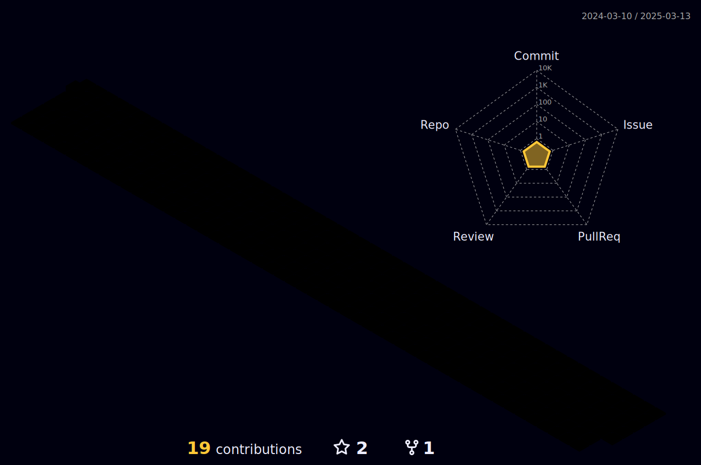

<h1 align="center">Hi 👋, I'm Michael</h1>

<p align="center"><a href="https://twitter.com/michael_ballos" target="blank"></a></p>

<table align="center">
 <tr>
 <td>
<a href="https://app.daily.dev/michaelballos"></a>
</td>
  <td>
  
   👨‍💻 I do my best to update my site at [michaelballos.me](https://www.michaelballos.me)
   
   <details>
   <summary>
   🧪 Currently on that grind 🦾 here are some work in progress: 
   </summary>
   
   [Design Patterns](https://github.com/michaelballos/design-patterns)
   
   [Component Library](https://github.com/github-projects-board)
   
   [GH Projects Component](https://github.com/github-projects-board)
   
   [JN](https://github.com/ngynjohn)
 
 </details>
 
 <details>
 <summary>
   📫 Best ways to contact me: 
 </summary>
 
  - ```Twitter DM:``` [@michael_ballos](https://www.twitter.com/michael_ballos)
 
  - ```Discord:``` kr0wd#5726
 
  - ```Email:``` **ballos.michael@gmail.com**
 </details>
</td>

</tr>
</table>




<table>
    <td>
       <a href="https://github.com/michaelballos"></a>
    </td>
    <td>
       <a href="http://www.github.com/michaelballos"></a>
    </td>
    <td>
      <a href="https://github.com/michaelballos"></a>
    </td>
  </tr>
    <tr>
   <th colspan="3">
    <a href="https://wwwgithub.com/michaelballos">
     </img>
    </a>
  <tr>
</table>
 
<h3 align="left">Connect with me:</h3>
<p align="left">
<a href="https://linkedin.com/in/michaelballos" target="blank"></a>
<a href="https://twitter.com/michael_ballos" target="blank"></a>
<a href="https://codepen.io/michaelballos" target="blank"></a>
<a href="https://dev.to/michaelballos" target="blank"></a>
<a href="https://codesandbox.com/michaelballos" target="blank"></a>
<a href="https://medium.com/@ballos.michael" target="blank"></a>
</p>

<h3 align="left">Tools I use:</h3>
<p align="left"> 
 <a href="https://www.typescriptlang.org/" target="_blank" rel="noreferrer">
   </a>
 
<a href="https://developer.mozilla.org/en-US/docs/Web/JavaScript" target="_blank" rel="noreferrer">
   </a> 
  
<a href="https://www.w3schools.com/css/" target="_blank" rel="noreferrer">
   
</a>
 
<a href="https://www.w3.org/html/" target="_blank" rel="noreferrer"> 
  
</a> 
 
<a href="https://reactjs.org/" target="_blank" rel="noreferrer"> 
  
</a>
  
<a href="https://nextjs.org/" target="_blank" rel="noreferrer">
   
</a> 
  
<a href="https://nodejs.org" target="_blank" rel="noreferrer">
  
</a>

<a href="https://getbootstrap.com/" target="_blank" rel="noreferrer">
   
</a>
  
<a href="https://www.docker.com/" target="_blank" rel="noreferrer">
   </a> 

<a href="https://expressjs.com" target="_blank" rel="noreferrer"> 
   </a> 
  
<a href="https://www.figma.com/" target="_blank" rel="noreferrer"> 
   
</a>

<a href="https://git-scm.com/" target="_blank" rel="noreferrer">
  
</a> 

<a href="https://graphql.org" target="_blank" rel="noreferrer"> 
   
</a>
  
<a href="https://www.linux.org/" target="_blank" rel="noreferrer"> 
   
</a>
  
<a href="https://www.photoshop.com/en" target="_blank" rel="noreferrer">
  
</a> 
  
<a href="https://www.postgresql.org" target="_blank" rel="noreferrer"> 
   
</a> 
  
<a href="https://postman.com" target="_blank" rel="noreferrer"> 
  
</a> 
</p>
  
### Blogs posts
<!-- BLOG-POST-LIST:START -->
<!-- BLOG-POST-LIST:END -->

