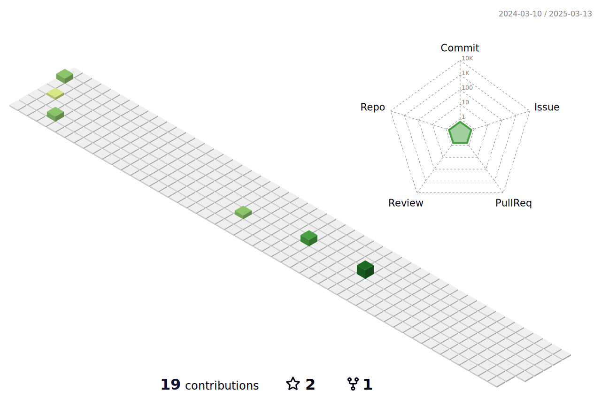

<h1 align="center">Hi 👋, I'm Michael</h1>
<h3 align="center">Particle Space Intern in Kansas City, MO

  
 

- 👯 I’m currently collaborating on [Electa API](https://github.com/electa-api)

- 👨‍💻 I’m personally working on a [Blog App](https://github.com/michaelballos/michaelballos.github.io)

- 🌱 I’m currently learning [Graphql](https://graphql.org/) and [Prisma](https://www.prisma.io/)

- ⚡ An example of my [dev skills](https://www.michaelballos.me)

- 📫 Reach me at **ballos.michael@gmail.com**

<h3 align="left">Connect with me:</h3>

<h3 align="left">Tools I use:</h3>

 
 
  

 
 
 

  
 
  

  
 

 
  

 

  

  
 
  
 
  
 

### Blogs posts
<!-- BLOG-POST-LIST:START -->
<!-- BLOG-POST-LIST:END -->
